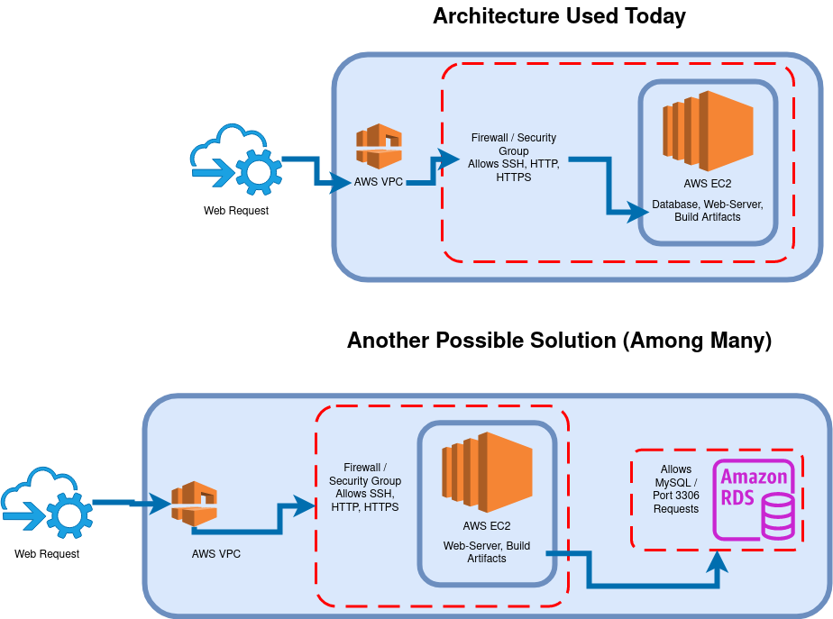

Deployment Walkthrough for Candidate Pool:

## What does it mean to deploy an application?

deliver service or application to the web, accessible by users

## What is required to deploy an application?

- some type of working codebase / project
- depending on codebase you will need certain dependencies on the server holding your application
Example:
  - Java/Spring application will need:
    - Java Runtime Environment
    - Source Code
    - Database if necessary
    - This is just for the application itself

## Static vs Dynamic websites

- static is pre-built or pre-defined
- dynamic is user-driven
- Examples of static websites throughout lc101, examples of dynamic (Orbit-Report, HTML Me Something, Techjobs)

## Brief Description of Linux

## Walkthrough:
- Existing Java Application (Dynamic)
- AWS EC2 + MySQL running on server and potentially RDS time permitting
- Caddy
	- tool used to serve web applications
- Ubuntu Host
	- chosen operating system for virtual machine
- ssh
	- secure shell into virtual machine to configure server
- DNS
	- domain name service to establish A record for ipv4-address
- reverse proxy
	- In this case a web user makes an HTTP request to a server. Caddy catches the initial HTTP request and passes it to a running application server. The application server processes the HTTP request and builds an appropriate HTTP response. The application server then passes the HTTP response back to Caddy who sends it back to the web user.

This walkthrough was a demonstration of deploying a java17 application onto an EC2 Instance.

A jar file was created from the project source code and delivered to the EC2 instance via git
  - a jar file contains all of the dependencies needed to run the application

## EC2 Instance Configuration

A jar file is not enough to start and run a java application on a fresh server. A JRE or JDK is still necessary. Knowing that the project was using java17 installing the appropriate jre is an easy task.

```bash
openjdk-17-jre/jammy-security,jammy-updates,now 17.0.8.1+1~us1-0ubuntu1~22.04 amd64 [installed,automatic]
  OpenJDK Java runtime, using Hotspot JIT
```


